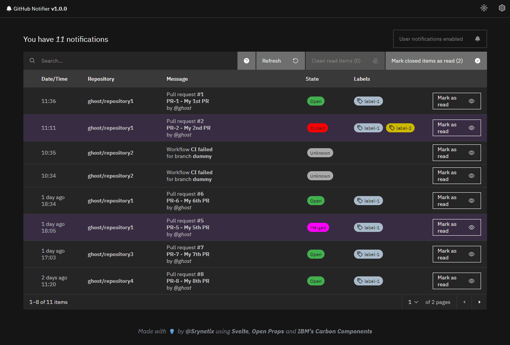

# GitHub Notifier

## Motivation

Have a simple and efficient view of your GitHub notifications.

**:rocket: Use it here: https://srynetix.github.io/github-notifier**

## Preview

## Features

- Filter closed issues and merged pull requests, mark them as read all at once,
- Sort and filter notifications by date, repository, status, author or labels,
- See linked information, like pull request / issue labels.

Notifications will be fetched every 60 seconds (most of the time, it's dynamically given by GitHub at each call).  
You will receive a native notification at each new message.

## How?

It's only based on GitHub APIs, using a _Personal Token_ you will need to create.

It's a [Svelte] application (my first official Svelte application!), using [Open-Props] and [IBM's Carbon Components].

## How to build?

You need:

- An up-to-date Node version (LTS) with `npm`

## TODO

- [ ] Better error handling
- [ ] Expose the website inside of a self-contained application (Electron? Tauri? Something else?)

[Svelte]: https://svelte.dev
[Open-Props]: https://open-props.style
[IBM's Carbon Components]: https://carbon-components-svelte.onrender.com/
